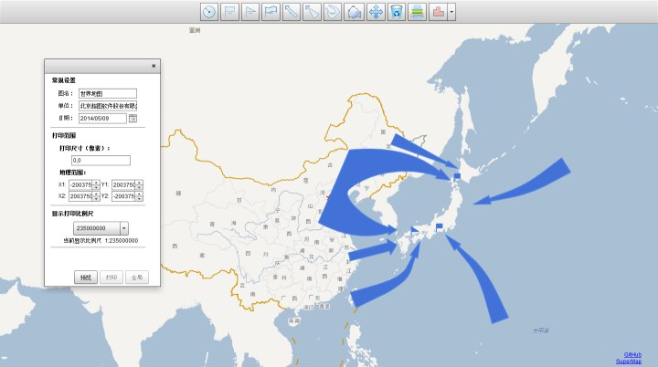
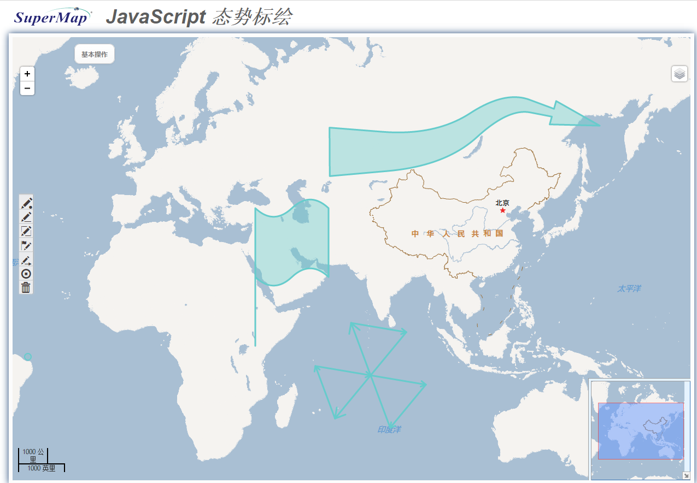

### 一、简介
标绘扩展符号库是一套基于SuperMap iClient 7C的基础库扩展的符号库，提供了常用复杂的几何对象，可以大大降低用户开发的难度和时间成本。现支持Flex和JavaScript两个产品。

### 二、支持的符号
支持如下标绘扩展符号的绘制以及编辑（flex支持历史回退）。

1.点（GeoPoint）（仅js支持）

2.多点（GeoMultiPoint）（仅js支持）

3.折线（GeoPolyline）（仅js支持）

4.圆弧（GeoArc）（仅js支持）

5.自由线（GeoFreeline）（仅js支持）

6.贝塞尔2次曲线（GeoBizer2）（仅js支持）

7.贝塞尔3次曲线（GeoBizer3）（仅js支持）

8.贝塞尔N次曲线（GeoBizerN）（仅js支持）

9.Cardinal曲线（GeoCardinalCurve）（仅js支持）

10.圆（GeoCircle）

11.椭圆（GeoEllipse）（仅js支持）

12.扇形（GeoSector）（仅js支持）

13.弓形（GeoLune）（仅js支持）

14.矩形（GeoRectangle）（仅js支持）

15.多边形（GeoPolygon）（仅js支持）

16.手绘面（GeoFreePolygon）（仅js支持）

17.聚居区（GeoGatheringPlace）（仅js支持）

18.圆角矩形（GeoRoundedRect）（仅js支持）

19.闭合曲线（GeoCloseCurve）（仅js支持）

20.曲线旗标（GeoCurveFlag）

21.直角旗标（GeoRectFlag）

22.三角旗标（GeoTriangleFlag）

23.直箭头（GeoStraightArrow）

24.斜箭头（GeoDiagonalArrow）

25.双箭头（GeoDoubleArrow）

26.燕尾直箭头（GeoDoveTailStraightArrow）（仅js支持）

27.燕尾斜箭头（GeoDoveTailDiagonalArrow）（仅js支持）

28.折线箭头（GeoPolylineArrow）（仅js支持）

29.平行搜寻区（GeoParallelSearch）（仅js支持）

30.扇形搜寻区（GeoSectorSearch）（仅js支持）

31.贝塞尔曲线箭头（GeoBezierCurveArrow）（仅js支持）

32.Cardinal曲线箭头（GeoCardinalCurveArrow）（仅js支持）

### 三、使用说明

参见源码注释、范例或者标绘扩展符号帮助文档。

### 四、许可授权

详见“LICENSE.txt”。

### 五、在线范例

javaScript范例地址：

http://lab.supermapol.com/plotting/javascript/example/index.html
